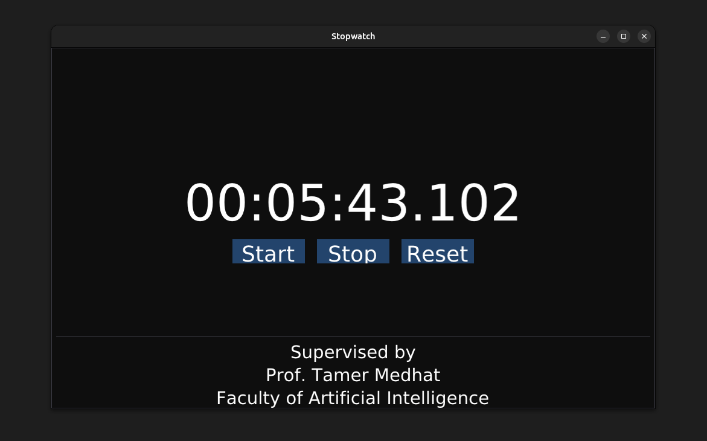

# C++ GUI Stopwatch

A simple graphical stopwatch application built in **C++** using **Dear ImGui**, **GLFW**, and **OpenGL**.

This project demonstrates how to build a lightweight GUI application in C++ with real-time timing using the C++ `chrono` library.

The application provides a clean graphical interface with **Start**, **Stop**, and **Reset** controls to manage the stopwatch.

---

# Screenshot



> *Screenshot of the stopwatch GUI running.*

Place your screenshot file here:

```
screenshots/stopwatch.png
```

Recommended repository structure:

```
cpp-stopwatch
│
├── main.cpp
├── imgui/
├── screenshots/
│   └── stopwatch.png
├── Makefile
└── README.md
```

---

# Features

* Real-time stopwatch timer
* Start / Stop / Reset functionality
* Simple graphical interface
* Centered UI layout
* Lightweight C++ implementation
* Cross-platform support (Linux / Windows)

---

# Technologies Used

* **C++**
* **Dear ImGui**
* **GLFW**
* **OpenGL**
* **C++ chrono library**

---

# Build and Run on Linux

## Install Dependencies

```
sudo apt update
sudo apt install build-essential libglfw3-dev libgl1-mesa-dev
```

## Clone the Repository

```
git clone https://github.com/engalaagabr/CPP-GUI-Stopwatch.git
cd cpp-stopwatch
```

## Build

```
make
```

or manually:

```
g++ main.cpp \
imgui/imgui.cpp \
imgui/imgui_draw.cpp \
imgui/imgui_widgets.cpp \
imgui/imgui_tables.cpp \
imgui/backends/imgui_impl_glfw.cpp \
imgui/backends/imgui_impl_opengl3.cpp \
-Iimgui -Iimgui/backends \
-lglfw -lGL -ldl \
-o stopwatch
```

## Run

```
./stopwatch
```

---

# Build and Run on Windows

Using **MSYS2 / MinGW64**

Install dependencies:

```
pacman -S mingw-w64-x86_64-gcc
pacman -S mingw-w64-x86_64-glfw
```

Compile:

```
g++ main.cpp ^
imgui/imgui.cpp ^
imgui/imgui_draw.cpp ^
imgui/imgui_widgets.cpp ^
imgui/imgui_tables.cpp ^
imgui/backends/imgui_impl_glfw.cpp ^
imgui/backends/imgui_impl_opengl3.cpp ^
-Iimgui -Iimgui/backends ^
-lglfw3 -lopengl32 -lgdi32 ^
-o stopwatch.exe
```

Run:

```
stopwatch.exe
```

---
THX

# License

This project is intended for educational purposes.
